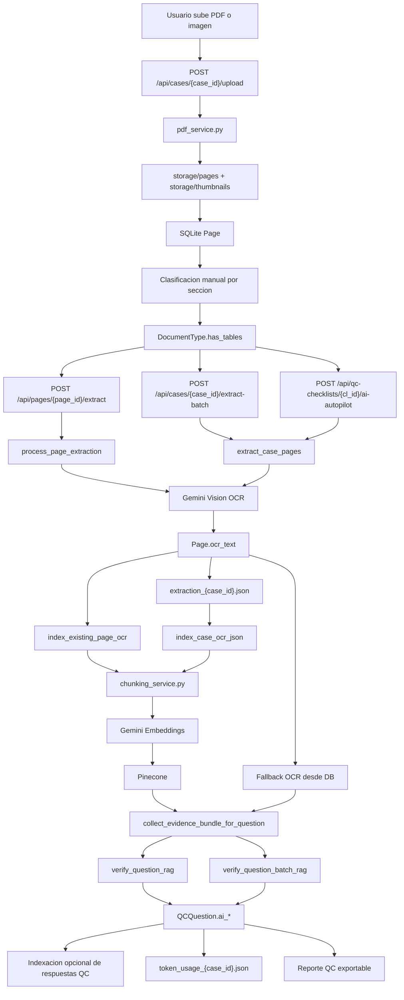

# PROCESO DE IA DEL PROYECTO

## 1. Resumen ejecutivo

Este proyecto usa IA en tres grandes momentos:

1. `OCR / extracción`: Google Gemini recibe imágenes de páginas y devuelve texto estructurado por pares `Pregunta:` / `Respuesta:`.
2. `Embeddings + RAG`: ese texto se fragmenta en chunks, se vectoriza con Gemini Embeddings y se indexa en Pinecone para búsquedas semánticas y recuperación de evidencia.
3. `Verificación QC`: Gemini vuelve a intervenir para decidir si una pregunta del checklist está verificada, incorrecta o sin evidencia suficiente, usando el texto recuperado por RAG.

No existe un pipeline de clasificación automática de páginas por IA. La clasificación de páginas dentro de la taxonomía documental es manual. Lo que sí existe es:

- auto-vinculación de preguntas QC a secciones del caso por matching de texto;
- extracción OCR automática dentro del Autopilot;
- recuperación semántica de evidencia;
- verificación automática de preguntas QC.

En otras palabras, la IA no decide "qué tipo de documento es cada página", pero sí extrae, indexa, busca y verifica contenido.

## 2. Stack de IA real

### Proveedores y servicios

- `Google Gemini`
  - OCR de páginas.
  - Embeddings para RAG.
  - Verificación QC individual y por lote.
- `Pinecone`
  - Almacenamiento vectorial de chunks OCR.
  - Almacenamiento opcional de respuestas QC verificadas.
- `SQLite`
  - Estado transaccional del caso, páginas, OCR, checklist y resultados AI.
- `storage/`
  - Archivos subidos, páginas renderizadas, miniaturas y JSONs de salida.

### Archivos clave

| Archivo | Papel en el pipeline |
|---|---|
| `backend/app/routers/pages.py` | Recibe uploads y crea páginas |
| `backend/app/services/pdf_service.py` | Convierte PDF a imágenes de página |
| `backend/app/routers/extraction.py` | Dispara OCR, reindexado y consultas RAG |
| `backend/app/services/extraction_service.py` | Hace OCR con Gemini Vision |
| `backend/app/services/indexing_service.py` | Orquesta OCR por página y reindexado |
| `backend/app/services/case_extraction_service.py` | OCR por lote a nivel de caso |
| `backend/app/services/ocr_index_service.py` | Chunking, embeddings y upsert a Pinecone |
| `backend/app/services/retrieval_service.py` | Recuperación de evidencia para RAG |
| `backend/app/services/ai_verify_service.py` | Verificación QC con Gemini |
| `backend/app/routers/qc_checklist.py` | Orquestación de Autopilot y verificación QC |
| `backend/app/prompts/extraction_prompts.py` | Prompts OCR |
| `backend/app/prompts/verification_prompts.py` | Prompts de verificación |
| `backend/app/prompts/toon_prompts.py` | Payloads JSON para verificación |
| `backend/app/services/rag_config.py` | Configuración del stack IA |
| `backend/app/services/json_export_service.py` | JSONs de extracción y tokens |

## 3. Punto de inicio: cómo entra el documento

El flujo arranca en frontend y backend así:

- En frontend existen llamadas a:
  - `extractPage()`
  - `extractBatch()`
  - `reindexPage()`
  - `reindexCase()`
  - `ragQuery()`
  - `startAutopilot()`
  - `aiVerifyQuestion()`
- Estas llamadas viven en `frontend/src/api/client.ts`.
- En la UI:
  - la búsqueda semántica del caso está en `frontend/src/pages/CaseWorkspace.tsx`;
  - la verificación AI de preguntas, partes y checklist está en `frontend/src/components/checklist/QCBuilderPanel.tsx`.

Antes de que exista IA, el sistema necesita páginas individuales.

### 3.1 Upload del archivo

Endpoint principal:

- `POST /api/cases/{case_id}/upload`

Archivo:

- `backend/app/routers/pages.py`

Qué hace:

1. Recibe uno o varios archivos PDF o imagen.
2. Guarda el archivo original en `storage/uploads/`.
3. Si el archivo es PDF, lo divide en páginas con `split_pdf()`.
4. Si el archivo es imagen, lo procesa como una sola página con `process_image()`.
5. Guarda cada página renderizada en `storage/pages/`.
6. Genera miniaturas en `storage/thumbnails/`.
7. Crea registros `Page` en SQLite con estado inicial `unclassified`.

Servicio implicado:

- `backend/app/services/pdf_service.py`

Resultado:

- ya no se trabaja sobre el PDF original para IA;
- la IA opera sobre imágenes individuales de páginas.

## 4. Decisión previa al OCR: modo texto vs modo tablas

El OCR puede operar en dos modos:

- `gemini_ocr`
- `gemini_tables`

La decisión sale del flag `has_tables` del `DocumentType`.

Archivos relevantes:

- `backend/app/routers/extraction.py`
- `backend/app/routers/documents.py`
- `backend/app/schemas.py`

Cómo funciona:

1. Cada tipo documental puede marcarse con `has_tables`.
2. Al extraer una página, si no se pasa `has_tables` manualmente, el sistema hereda el valor del `DocumentType` asociado a la página.
3. Ese valor decide qué prompt OCR se usa.

Esto es importante porque el OCR del proyecto no es genérico: cambia su instrucción según si espera formularios/tablas o texto más lineal.

## 5. Fase 1 de IA: OCR con Gemini

## 5.1 Disparadores

Hay dos formas principales de lanzar OCR:

- página individual:
  - `POST /api/pages/{page_id}/extract`
- lote por caso:
  - `POST /api/cases/{case_id}/extract-batch`

Archivo:

- `backend/app/routers/extraction.py`

El Autopilot también puede disparar OCR automáticamente, como se explica más adelante.

## 5.2 Orquestación por página

Función principal:

- `process_page_extraction()`

Archivo:

- `backend/app/services/indexing_service.py`

Secuencia:

1. Busca la `Page` en la base de datos.
2. Marca `extraction_status = processing`.
3. Resuelve la ruta absoluta de la imagen en `storage/pages/...`.
4. Elige `gemini_ocr` o `gemini_tables`.
5. Llama a `extract_text()` del servicio OCR.
6. Guarda el texto en `page.ocr_text`.
7. Guarda el método usado en `page.extraction_method`.
8. Si hay vector store configurado, deja la página lista para indexado.
9. Si no hay vector store, marca el indexado como `skipped`.

Campos persistidos en `Page`:

- `ocr_text`
- `extraction_status`
- `extraction_method`
- `index_status`
- `index_method`
- `indexed_vector_count`
- `pinecone_document_id`

## 5.3 Servicio OCR real

Función principal:

- `extract_text(image_path, has_tables=False, ...)`

Archivo:

- `backend/app/services/extraction_service.py`

Qué hace internamente:

1. Carga el cliente Gemini.
2. Lee la configuración desde `rag_config.py`.
3. Abre la imagen de la página con PIL.
4. La reduce y convierte para bajar costo de tokens de imagen.
5. Construye el prompt OCR adecuado.
6. Intenta reutilizar caché explícita del prompt en Gemini.
7. Llama a `client.models.generate_content(...)`.
8. Registra uso de tokens.
9. Devuelve `response.text`.

### 5.3.1 Preprocesamiento de imagen

Antes de enviar la imagen a Gemini:

- se convierte a RGB;
- se redimensiona según `OCR_IMAGE_MAX_LONG_EDGE`;
- se recomprime a JPEG con `OCR_IMAGE_JPEG_QUALITY`.

Objetivo:

- bajar tokens de entrada;
- mantener suficiente legibilidad para OCR.

### 5.3.2 Modelo usado

El OCR usa:

- `GEMINI_VISION_MODEL`, o
- `GEMINI_MODEL` como fallback

La selección se hace en `backend/app/services/extraction_service.py`.

## 5.4 Forma de salida del OCR

El OCR no devuelve JSON estructurado propio del dominio. Devuelve texto plano con formato muy específico:

- pares `Pregunta:`
- pares `Respuesta:`

Ese formato está definido en:

- `backend/app/prompts/extraction_prompts.py`

Por tanto, el sistema convierte una imagen compleja de formulario legal en texto intermedio semiestructurado. Ese texto es la base para todo lo demás.

## 5.5 OCR por lote de caso

Función principal:

- `extract_case_pages()`

Archivo:

- `backend/app/services/case_extraction_service.py`

Qué hace:

1. Reúne páginas del caso.
2. Puede filtrar solo páginas faltantes (`only_missing=True`).
3. Calcula `has_tables` por página.
4. Corre OCR concurrente con `ThreadPoolExecutor`.
5. Va acumulando resultados y progreso.
6. Construye una lista consolidada de páginas extraídas.
7. Escribe `extraction_<case_id>.json`.
8. Devuelve resumen de OCR y tokens.

Resultado persistente:

- `storage/exports/extraction_<case_id>.json`

Archivo responsable:

- `backend/app/services/json_export_service.py`

## 6. Salida intermedia tras OCR

Después del OCR, el proyecto conserva la información en dos sitios:

### 6.1 SQLite

En la tabla `pages`:

- el texto OCR vive en `Page.ocr_text`;
- el estado de extracción e indexación queda persistido;
- esto permite que otros procesos usen el OCR sin repetir Gemini.

### 6.2 JSON de extracción

Archivo:

- `storage/exports/extraction_<case_id>.json`

Contenido:

- `case_id`
- `generated_at`
- `total_pages`
- lista de páginas con:
  - `page_id`
  - `page_number`
  - `original_filename`
  - `extraction_method`
  - `extraction_status`
  - `chars`
  - `ocr_text`

Este JSON es la fuente usada para reindexar el caso completo.

## 7. Fase 2 de IA: embeddings e indexación vectorial

Una vez que existe OCR, el sistema puede indexarlo en Pinecone.

## 7.1 Dos caminos de indexación

1. `index_existing_page_ocr(page_id)`
   - reindexa una sola página que ya tiene OCR.
2. `index_case_ocr_json(case_id)`
   - reindexa todo el caso a partir del JSON consolidado.

Archivos:

- `backend/app/services/indexing_service.py`
- `backend/app/services/ocr_index_service.py`

## 7.2 Construcción de chunks

Archivo:

- `backend/app/services/chunking_service.py`

Proceso:

1. El texto OCR se divide por secciones si detecta headers.
2. Si un bloque es largo, se parte por párrafos o sliding window.
3. Se aplica overlap entre chunks.
4. Se descartan chunks basura:
   - muy cortos;
   - footers;
   - texto con poca densidad alfanumérica.

Variables relevantes:

- `OCR_CHUNK_SIZE`
- `OCR_CHUNK_OVERLAP`

## 7.3 Metadatos por chunk

Cada chunk OCR se indexa con metadatos ricos:

- `case_id`
- `page_id`
- `page_number`
- `original_filename`
- `document_type_id`
- `document_type_code`
- `section_id`
- `section_path_code`
- `section_name`
- `is_primary_section`
- `chunk_order`
- `source_type`
- `document_id`
- `document_title`
- `section_label`
- `created_at`
- `text`

Esto permite después filtrar búsquedas por:

- caso;
- página;
- sección;
- tipo documental.

## 7.4 Embeddings

Archivo:

- `backend/app/services/embedding_service.py`

Funciones:

- `get_embedding()`
- `get_embedding_batch()`

Modelo:

- `EMBEDDING_MODEL`

Uso:

- `RETRIEVAL_DOCUMENT` para chunks/documentos;
- `RETRIEVAL_QUERY` para consultas y preguntas QC.

El sistema incluye:

- batch processing;
- reintentos con backoff;
- cálculo y tracking de tokens de embeddings.

## 7.5 Pinecone

Archivo:

- `backend/app/services/pinecone_client.py`

Conceptos:

- índice: `PINECONE_INDEX_OCR`
- namespace por caso: `case-{case_id}` o el prefijo configurado

Qué se indexa:

1. chunks OCR del caso;
2. opcionalmente respuestas QC verificadas.

Operaciones usadas:

- `upsert`
- `query`
- `delete`
- borrado por prefijo de IDs

## 7.6 Cuándo se indexa

Hay varios caminos:

- reindex manual de una página;
- reindex manual de un caso;
- Autopilot, si detecta OCR nuevo y Pinecone está configurado;
- reclasificación de páginas puede disparar reindex, porque cambia el contexto de sección del chunk.

## 8. Fase 3 de IA: retrieval y RAG

Una vez indexados los chunks, el sistema puede recuperar evidencia.

Archivo principal:

- `backend/app/services/retrieval_service.py`

## 8.1 Estrategia de búsqueda

La recuperación de evidencia sigue una búsqueda de lo más específico a lo más amplio:

1. `evidence_pages`
2. `target_sections`
3. `case_wide`

Esto significa:

- si la pregunta QC tiene páginas explícitas vinculadas, se buscan primero;
- si tiene secciones objetivo, se buscan después;
- si no alcanza, se abre a todo el caso.

## 8.2 Ranking de evidencia

El retrieval no solo usa score vectorial. También aplica reglas extra:

- bonus si detecta checkboxes;
- bonus si detecta patrones `Yes/No`;
- bonus si el `source_type` viene de Gemini.

También hace:

- deduplicación de matches;
- truncado por máximo de caracteres;
- armado de `source_pages`;
- construcción de texto plano para pasar a Gemini.

## 8.3 Fallback sin Pinecone

Si Pinecone no está configurado, el sistema puede caer a un modo degradado:

- reúne `ocr_text` directamente desde SQLite;
- concatena texto de páginas del caso;
- lo usa como contexto sin búsqueda semántica real.

Esto existe en:

- `_ocr_text_from_db()`

Por tanto, el sistema puede seguir verificando con IA aunque sin recuperación vectorial de calidad.

## 8.4 Endpoint de búsqueda semántica del caso

Endpoint:

- `POST /api/cases/{case_id}/rag/query`

Uso:

- permite hacer preguntas libres sobre el contenido indexado del caso.

Frontend:

- panel "Búsqueda Semántica (RAG)" en `frontend/src/pages/CaseWorkspace.tsx`.

## 9. Fase 4 de IA: verificación QC

La verificación QC es el momento donde Gemini toma una decisión de negocio:

- `YES`
- `NO`
- `INSUFFICIENT`

Archivo principal:

- `backend/app/services/ai_verify_service.py`

## 9.1 Modos implementados

El servicio define tres modos:

### A. Verificación por imagen

Funciones:

- `verify_question()`
- `verify_question_multi_page()`

Entrada:

- imagen o imágenes;
- pregunta QC;
- fuentes esperadas;
- contexto OCR adicional.

Salida:

- JSON estructurado con:
  - `decision`
  - `justification`
  - `correction`

Estado actual:

- el servicio existe;
- pero el router principal de QC no parece usar este modo hoy.

### B. Verificación RAG de una sola pregunta

Función:

- `verify_question_rag()`

Entrada:

- pregunta;
- `where_to_verify`;
- texto de evidencia recuperado por RAG;
- tipo de formulario inferido.

Salida normalizada por backend:

- `answer`
- `confidence`
- `explanation`
- `correction`

### C. Verificación RAG por lote

Función:

- `verify_question_batch_rag()`

Entrada:

- lista de preguntas con `id`, `description`, `where_to_verify`;
- evidencia por pregunta.

Objetivo:

- verificar muchas preguntas en una sola llamada a Gemini;
- reducir latencia y costo total del Autopilot.

## 9.2 Prompts de verificación

Archivo:

- `backend/app/prompts/verification_prompts.py`

Hay tres familias:

1. prompt por imagen:
   - `VERIFY_PROMPT`
2. prompt RAG por una pregunta:
   - `build_rag_verify_system_prompt()`
   - `build_rag_verify_request_prompt()`
3. prompt batch RAG:
   - `build_rag_batch_system_prompt()`
   - `build_rag_batch_request_prompt()`

Además:

- `backend/app/prompts/toon_prompts.py` arma el payload JSON que se inyecta como `INPUT`.

## 9.3 Esquema de salida

Gemini no responde libremente. El backend le exige JSON con `response_json_schema`.

Schemas usados:

- `VerificationResult`
- `BatchVerificationResult`

Esto reduce ambigüedad y ayuda a persistir resultados directamente.

## 10. Orquestación completa: AI Autopilot

El flujo más ambicioso del proyecto vive en:

- `backend/app/routers/qc_checklist.py`

Endpoint de entrada:

- `POST /api/qc-checklists/{cl_id}/ai-autopilot`

Seguimiento del job:

- `GET /api/qc-autopilot-jobs/{job_id}`

Estado en memoria:

- `backend/app/services/qc_autopilot_jobs.py`

Frontend:

- `frontend/src/components/checklist/QCBuilderPanel.tsx`

## 10.1 Qué intenta hacer el Autopilot

Secuencia diseñada:

1. cargar preguntas del checklist;
2. omitir preguntas ya verificadas si así está configurado;
3. asegurar OCR faltante en páginas del caso;
4. escribir `extraction_<case_id>.json`;
5. indexar OCR nuevo en Pinecone;
6. generar embeddings de las preguntas QC;
7. recolectar evidencia por pregunta;
8. ejecutar verificación batch con Gemini;
9. guardar respuestas AI en `QCQuestion`;
10. opcionalmente indexar respuestas QC;
11. escribir resumen final de tokens;
12. marcar job como completado.

## 10.2 Qué persiste al final

Sobre cada `QCQuestion`:

- `ai_answer`
- `ai_notes`
- `ai_confidence`
- `ai_verified_at`

Y, si la respuesta manual aún estaba vacía:

- también rellena `answer`
- `correction`
- `notes`

Además puede escribir:

- `storage/exports/token_usage_<case_id>.json`

Y registra auditoría en `AuditLog`.

## 10.3 Indexación opcional de respuestas QC

Archivo:

- `backend/app/services/checklist_index_service.py`

Cuando se activa:

- cada pregunta QC verificada se embebe;
- se sube a Pinecone como `record_type = checklist-answer`;
- luego puede consultarse con:
  - `POST /api/qc-checklists/{cl_id}/semantic-query`

Esto crea una segunda capa RAG, ya no sobre OCR bruto, sino sobre respuestas QC ya verificadas.

## 11. Flujo extremo a extremo

## 12. Datos y artefactos generados durante el pipeline

### 12.1 Base de datos SQLite

Archivo real:

- `backend/data/app.db`

Entidades relevantes:

- `Page`
- `QCChecklist`
- `QCQuestion`
- `QCQuestionEvidence`
- `AuditLog`

### 12.2 Storage

Rutas:

- `backend/storage/uploads/`
- `backend/storage/pages/`
- `backend/storage/thumbnails/`
- `backend/storage/exports/`

### 12.3 JSONs de salida

Generados por:

- `backend/app/services/json_export_service.py`

Archivos:

- `extraction_<case_id>.json`
- `token_usage_<case_id>.json`

### 12.4 Pinecone

Contenido:

- chunks OCR del caso;
- respuestas QC indexadas opcionalmente.

Namespace:

- con prefijo configurable, por defecto `case-<case_id>`.

## 13. Configuración relevante del stack IA

El proyecto lee configuración desde:

- `backend/app/services/rag_config.py`

Variables clave, sin exponer valores:

### Gemini

- `GEMINI_API_KEY`
- `GEMINI_MODEL`
- `GEMINI_VISION_MODEL`
- `GEMINI_ENABLE_EXPLICIT_CACHE`
- `GEMINI_CACHE_TTL_SECONDS`
- `GEMINI_CACHE_REFRESH_BUFFER_MS`
- `GEMINI_CACHE_REUSE_LOG_COOLDOWN_MS`
- `GEMINI_LOG_TOKEN_USAGE`
- `GEMINI_LOG_TOKEN_DETAILS`

### Embeddings

- `EMBEDDING_MODEL`
- `EMBEDDING_DIMENSION`
- `EMBEDDING_TASK_TYPE_QUERY`
- `EMBEDDING_TASK_TYPE_DOCUMENT`
- `EMBEDDING_BATCH_SIZE`
- `EMBEDDING_MAX_RETRIES`
- `EMBEDDING_RETRY_BASE_MS`

### RAG / chunking

- `OCR_CHUNK_SIZE`
- `OCR_CHUNK_OVERLAP`
- `RETRIEVAL_TOP_K`
- `EVIDENCE_CONTEXT_MAX_CHARS`
- `DB_FALLBACK_MAX_CHARS`

### Pinecone

- `PINECONE_API_KEY`
- `PINECONE_INDEX_OCR`
- `PINECONE_NAMESPACE_PREFIX`

### QC Autopilot

- `QC_AUTOPILOT_BATCH_SIZE`
- `QC_AUTOPILOT_EVIDENCE_TOP_K`
- `QC_AUTOPILOT_EVIDENCE_MAX_CHARS`
- `QC_AUTOPILOT_EVIDENCE_WORKERS`
- `QC_AUTOPILOT_SKIP_PREVERIFIED`
- `QC_AUTOPILOT_FORCE_BATCH_ON_NO_EVIDENCE`
- `QC_AUTOPILOT_INDEX_ANSWERS`

### OCR por imagen

- `OCR_IMAGE_MAX_LONG_EDGE`
- `OCR_IMAGE_JPEG_QUALITY`

## 14. Uso de tokens y caching

Archivo principal:

- `backend/app/services/gemini_runtime_service.py`

El proyecto implementa:

- tracking de tokens de generación;
- tracking de tokens de embeddings;
- resumen compacto por fase;
- caché explícita del prompt OCR;
- reutilización e invalidación de caché si Gemini reporta contenido expirado o inválido.

Esto afecta directamente:

- costo de OCR;
- costo del batch de verificación;
- velocidad del pipeline.

## 15. Qué sí está funcionando conceptualmente de punta a punta

Tomando el código tal como está, el flujo más sólido es este:

1. el usuario sube documentos;
2. el backend los parte en páginas;
3. las páginas se clasifican manualmente;
4. se corre OCR con Gemini por página o por lote;
5. el texto queda persistido en SQLite y en JSON de extracción;
6. ese texto se puede indexar en Pinecone;
7. se puede consultar por RAG;
8. una pregunta QC individual puede verificarse con `verify_question_rag()` si hay evidencia recuperable;
9. los resultados AI quedan guardados en `QCQuestion`.

## 16. Flujo secundario: verificación puntual de una pregunta

Endpoint:

- `POST /api/qc-questions/{q_id}/ai-verify`

Secuencia:

1. reúne páginas ligadas a la pregunta o a sus secciones objetivo;
2. recupera evidencia con `collect_evidence_bundle_for_question()`;
3. pasa el texto a `verify_question_rag()`;
4. guarda el resultado AI;
5. opcionalmente indexa la respuesta QC.

Este flujo es más simple que el Autopilot y refleja mejor el camino real de verificación individual.

## 17. Flujo secundario: búsqueda semántica del caso

Endpoint:

- `POST /api/cases/{case_id}/rag/query`

Sirve para:

- preguntas libres del usuario sobre el contenido OCR del caso.

No genera una respuesta redactada por LLM. Devuelve matches semánticos desde Pinecone con metadata.

## 18. Flujo secundario: búsqueda semántica del checklist ya verificado

Endpoint:

- `POST /api/qc-checklists/{cl_id}/semantic-query`

Sirve para:

- buscar sobre respuestas QC indexadas, no sobre OCR bruto.

Solo existe si hubo indexación de respuestas QC.

## 19. Brechas, riesgos y comportamiento incompleto detectado

Esta sección es importante: lo siguiente no es especulación, sino lectura directa del código.

### 19.1 No hay clasificación automática por IA

Aunque el proyecto se llama "Document Categorizer", la categorización de páginas no la hace un modelo. Las páginas se suben como `unclassified` y luego un humano las asigna a secciones.

Sí existe auto-link de preguntas QC a secciones, pero eso es matching textual, no clasificación documental por LLM.

### 19.2 El modo de verificación por imagen existe, pero no está conectado al flujo principal

`ai_verify_service.py` define:

- `verify_question()`
- `verify_question_multi_page()`

Pero el router principal de verificación usa `verify_question_rag()`. En la práctica, el flujo principal actual verifica desde texto recuperado, no desde imagen.

### 19.3 `verify_question_batch_rag()` tiene variables no resueltas

En `backend/app/services/ai_verify_service.py`, la función usa:

- `use_prompt_cache`
- `batch_model`
- `fast_batch_prompt`
- `batch_max_output_tokens`

Esas variables no están definidas dentro de la función ni se resuelven claramente desde `rag_config.py`. Esto hace que la ruta batch del Autopilot tenga riesgo real de fallo.

### 19.4 `case_extraction_service.py` usa constantes no definidas para batch mode

El módulo usa:

- `EXTRACTION_BATCH_SIZE`
- `PARALLEL_BATCHES`

pero esas constantes no se definen en el archivo. El OCR concurrente simple sí está claro, pero el branch de batch mode queda inconsistente.

### 19.5 La recolección batch de evidencia del Autopilot está incompleta

En `backend/app/routers/qc_checklist.py`, dentro de `_run_ai_autopilot_job()`, la función interna `_collect_single_question_evidence()`:

- intenta actualizar `has_any_evidence`;
- intenta reportar progreso usando `idx`;

pero el código visible no muestra un lazo completo que ejecute esa función correctamente ni define `idx` en ese scope. Eso sugiere que la fase batch de evidencia del Autopilot está incompleta o rota.

### 19.6 Hay desalineación entre comentarios/documentación y el prompt OCR real

El comportamiento descrito en algunos comentarios internos y en `README.md` no coincide del todo con el prompt operativo actual:

- `backend/app/services/extraction_service.py` todavía describe que el modo de tablas devuelve Markdown estructurado;
- `README.md` también afirma que el modo tablas produce Markdown;
- pero `backend/app/prompts/extraction_prompts.py` obliga explícitamente a responder solo con líneas `Pregunta:` / `Respuesta:` y prohíbe Markdown.

Esto no rompe por sí solo el pipeline, pero sí vuelve más confuso entender la salida real del OCR si uno se guía solo por la documentación secundaria.

### 19.7 El documento debe distinguir entre flujo diseñado y flujo ejecutable

Por lo anterior:

- el diseño del sistema sí es claramente `OCR -> embeddings -> retrieval -> verificación batch -> persistencia`;
- pero no todas las piezas del camino batch están cerradas de forma consistente.

La parte más robusta hoy parece ser:

- OCR por página;
- OCR por lote de caso;
- reindexado;
- consulta RAG;
- verificación individual RAG.

## 20. Conclusión

El proceso de IA de este proyecto no es un solo paso, sino una cadena de transformaciones:

1. imagen de página;
2. OCR semiestructurado con Gemini;
3. texto persistido en DB y JSON;
4. chunking y embeddings;
5. indexación en Pinecone;
6. recuperación de evidencia por RAG;
7. decisión QC con Gemini;
8. persistencia de resultados y exportación.

La arquitectura está bien orientada para un flujo legal asistido por IA y muestra una separación clara entre:

- almacenamiento transaccional;
- recuperación semántica;
- decisiones de verificación.

Sin embargo, a nivel de estado actual, el camino más confiable es el flujo de OCR + RAG + verificación individual, mientras que el Autopilot batch todavía refleja partes del diseño que requieren cierre técnico para considerarse totalmente operativo de principio a fin.
