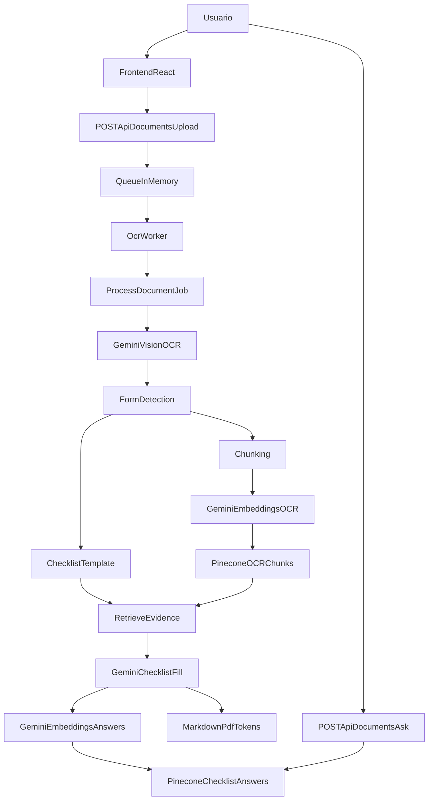

# Proceso de IA del proyecto OcrDocPinecone

## Alcance

Este documento describe el flujo de IA verificable en el codigo del proyecto, desde la carga de PDFs en el frontend hasta la generacion de checklists, la indexacion de resultados y la consulta posterior desde la UI.

La explicacion se basa solo en el codigo existente. Cuando el estado actual del repositorio no garantiza que algo funcione en runtime, se indica de forma explicita en la seccion de caveats.

## Resumen ejecutivo

- El usuario sube uno o varios PDFs desde `Frontend/src/App.jsx`, y el frontend llama a `POST /api/documents/upload`.
- El backend guarda temporalmente los archivos, crea un job en memoria y lo pasa a un worker registrado en `Backend/src/workers/ocrIndex.worker.js`.
- Cada PDF se procesa con OCR por vision usando Gemini. El resultado se guarda por paginas y se registra el consumo de tokens.
- Con el texto OCR de cada archivo, el sistema detecta si el documento parece ser `i-914`, `i-914a`, `supporting` o `unsupported`.
- Cada archivo se indexa en Pinecone como chunks OCR con embeddings generados por Gemini.
- Si el archivo pertenece a un formulario soportado (`i-914` o `i-914a`), el sistema carga una plantilla Markdown, extrae sus preguntas, recupera evidencia desde Pinecone y usa Gemini para responderlas en lotes.
- Las respuestas del checklist se vuelven a indexar en Pinecone para habilitar consultas posteriores por similitud semantica.
- El resultado final se materializa en Markdown, PDF y un reporte JSON de tokens. El endpoint `/ask` consulta esas respuestas ya indexadas y no invoca un LLM en tiempo real.

## Diagrama general



## Vista de extremo a extremo

1. El frontend permite subir varios PDFs, iniciar el procesamiento y consultar el estado del job.
2. El backend guarda los PDFs en `storage/uploads`, crea un job en memoria y lo mete en una cola en memoria.
3. Un worker toma el job y ejecuta `processDocumentJob`.
4. Cada archivo del job pasa por OCR con Gemini Vision.
5. Con el OCR resultante, el sistema detecta el tipo de formulario.
6. Cada archivo se parte en chunks, se embebe y se inserta en Pinecone.
7. Solo los formularios con plantilla soportada generan checklist.
8. Para cada pregunta del checklist, el sistema recupera evidencia desde Pinecone y pide a Gemini una respuesta estructurada.
9. El checklist completado se guarda como Markdown y PDF, y sus respuestas se indexan de nuevo en Pinecone.
10. Cuando el usuario hace una pregunta en la UI, el backend busca la respuesta mas cercana dentro de las respuestas de checklist ya indexadas.

## Componentes principales

| Capa | Archivo(s) clave | Responsabilidad |
| --- | --- | --- |
| Frontend | `Frontend/src/App.jsx`, `Frontend/src/services/api.js` | Subida de PDFs, polling de estado, carga de resultados y preguntas posteriores |
| API backend | `Backend/app.js`, `Backend/src/routes/documents.routes.js` | Expone rutas de upload, status, result, downloads y ask |
| Cola y jobs | `Backend/src/queue/queueClient.js`, `Backend/src/store/jobStore.js` | Maneja jobs en memoria, concurrencia y limpieza diferida |
| Worker | `Backend/src/workers/ocrIndex.worker.js` | Ejecuta el pipeline principal |
| Orquestacion | `Backend/src/services/documentPipeline.service.js` | Coordina OCR, deteccion, indexacion, checklist y PDF |
| OCR y LLM | `Backend/src/services/ocr.service.js`, `Backend/src/services/gemini.service.js` | OCR por vision, prompts JSON, embeddings, tracking de tokens |
| Prompts | `Backend/src/prompts/ocr.prompts.js`, `Backend/src/prompts/formDetector.prompts.js`, `Backend/src/prompts/checklist.prompts.js` | Define formatos de entrada y salida para Gemini |
| Vector DB | `Backend/src/pinecone/*.js` | Chunking, embeddings, upserts y queries en Pinecone |
| Templates | `Backend/src/services/checklistExtractor.service.js`, `Backend/src/templates/*.template.md` | Carga y parsea plantillas de checklist |
| Salida final | `Backend/src/services/pdfGenerator.service.js` | Convierte Markdown a PDF |

## Flujo detallado por etapa

### 1. Disparo desde el frontend

El frontend es una SPA en React. La accion principal de inicio es:

- `uploadDocuments(files)` en `Frontend/src/services/api.js`
- Ruta backend: `POST /api/documents/upload`

Despues del upload:

- El frontend hace polling de `GET /api/documents/:jobId/status` cada 3 segundos.
- El frontend consulta `GET /api/documents/queue` cada 5 segundos.
- Cuando el job termina, carga `GET /api/documents/:jobId/result`.
- Si el usuario pregunta algo sobre una checklist, llama a `POST /api/documents/:jobId/ask`.

La UI deja ver desde el inicio que el flujo esperado es:

- subida de PDF
- espera en cola
- procesamiento
- descarga de checklist
- consulta posterior sobre la checklist

### 2. Entrada de archivos, cola y worker

La ruta `POST /api/documents/upload` en `Backend/src/routes/documents.routes.js` hace lo siguiente:

1. Usa Multer desde `Backend/src/middleware/upload.middleware.js`.
2. Guarda los PDFs en `Backend/storage/uploads`.
3. Construye un payload con `filePath`, `originalName`, `mimeType` y `fileSize`.
4. Llama a `enqueueJob(payload)`.

La cola no usa Redis, RabbitMQ ni BullMQ. El codigo real implementa:

- `pendingQueue`: array en memoria
- `activeCount`: contador de jobs activos
- `jobStore`: `Map` en memoria

El worker se registra en `Backend/src/workers/ocrIndex.worker.js` y ejecuta `processDocumentJob(job, setProgress)`.

### 3. Orquestacion principal del pipeline

El centro del proceso esta en `Backend/src/services/documentPipeline.service.js`.

La secuencia del pipeline es esta:

| Etapa | Rango de progreso | Funcion principal | Resultado |
| --- | --- | --- | --- |
| OCR | 3-42 | `extractDocumentText()` | Texto OCR por pagina para cada PDF |
| Deteccion | 42-46 | `detectFormTypes()` | Clasificacion por archivo |
| Indexacion OCR | 46-66 | `upsertOcrChunks()` | Chunks OCR embebidos en Pinecone |
| Checklist RAG | 66-93 | `generateFilledChecklist()` | Checklist completado con respuestas |
| Reindexacion checklist | Dentro de checklist | `upsertChecklistAnswers()` | Respuestas del checklist en Pinecone |
| PDF | 93-100 | `generatePdfFromMarkdown()` | PDF final por checklist |

Tambien hay dos pasos laterales importantes:

- Los PDFs subidos se borran despues del OCR.
- Al final se escribe un JSON de tokens con el resumen de consumo del job.

### 4. OCR con Gemini Vision

La etapa de OCR se implementa entre `Backend/src/services/ocr.service.js` y `Backend/src/services/gemini.service.js`.

#### 4.1 Preparacion del PDF

`extractDocumentText()`:

- lee el PDF desde disco
- usa `pdf-lib` para contar paginas
- puede generar un PDF temporal por pagina o por grupo de paginas

#### 4.2 Estrategia de OCR

El flujo esperado del OCR es:

- elegir concurrencia objetivo segun el numero de paginas
- elegir perfil de prompt (`full` o `compact`)
- agrupar paginas en lotes para enviarlas a Gemini Vision
- intentar OCR por lote con `extractPagesTextWithVision()`
- si el lote falla o queda incompleto, caer a OCR por pagina con `extractPageTextWithVision()`

#### 4.3 Formato de salida del OCR

Los prompts OCR piden formatos muy especificos:

| Tipo de llamada | Archivo | Formato esperado |
| --- | --- | --- |
| OCR por pagina | `Backend/src/prompts/ocr.prompts.js` | Texto plano con pares `Pregunta:` / `Respuesta:` |
| OCR por lote | `Backend/src/prompts/ocr.prompts.js` | JSON con forma `{"pages":[{"pageNumber":1,"text":"..."}]}` |

Cada pagina procesada termina representada con campos como:

- `pageNumber`
- `text`
- `sourceType`
- `confidence`

#### 4.4 Tracking de tokens

`createTokenTracker()` en `Backend/src/services/gemini.service.js` registra:

- tokens de entrada
- tokens de salida
- tokens cacheados
- tokens de pensamientos
- tokens de embeddings

Al final del job se genera un JSON con agregados por fase.

#### 4.5 Cache de prompts OCR

El servicio Gemini intenta crear y reutilizar cache explicita de prompts OCR a traves de `client.caches.create(...)`. Eso significa que el sistema no solo llama a Gemini para OCR, sino que ademas intenta reutilizar el contexto fijo del prompt para abaratar o estabilizar llamadas repetidas.

### 5. Deteccion del tipo de formulario

La deteccion vive en `Backend/src/services/formDetector.service.js`.

El proceso por archivo es:

1. Tomar las primeras 5 paginas OCR.
2. Unir su texto.
3. Si hay poco texto, marcar como `supporting`.
4. Probar primero reglas por keywords.
5. Si no alcanza, usar un prompt JSON con Gemini.

Los posibles resultados son:

- `i-914`
- `i-914a`
- `supporting`
- `unsupported`

El prompt de deteccion en `Backend/src/prompts/formDetector.prompts.js` exige una salida JSON con esta forma logica:

```json
{
  "formType": "i-914|i-914a|unsupported|supporting",
  "detectedFormCode": "i-xxx o vacio",
  "reason": "explicacion corta"
}
```

Solo `i-914` e `i-914a` activan la generacion de checklist. Los demas archivos pueden quedar indexados como evidencia, pero no generan checklist propio.

### 6. IDs y aislamiento por archivo

Hay tres identificadores importantes en el flujo:

| ID | Ejemplo | Uso |
| --- | --- | --- |
| `job.id` | `uuid-del-job` | Identifica el job completo |
| `scopedDocumentId` | `jobId-f0` | Identifica un archivo concreto dentro del job para OCR y retrieval |
| `checklistId` | `f0-i-914` | Identifica una checklist ya generada |

Este detalle es clave:

- Los chunks OCR se indexan por `scopedDocumentId`, es decir, por archivo individual.
- Las respuestas de checklist se indexan usando `documentId = job.id`, mas `checklistId`.

Consecuencia practica:

- Durante la generacion del checklist, la recuperacion de evidencia queda aislada al archivo del formulario soportado.
- En la consulta posterior por `/ask`, la busqueda se hace contra respuestas de checklist del job completo, no contra los chunks OCR originales.

### 7. Chunking y embeddings del OCR

La indexacion OCR ocurre en `Backend/src/pinecone/upsertOcrChunks.js`.

#### 7.1 Chunking

`chunkText()` en `Backend/src/pinecone/chunkText.js`:

- divide por encabezados de seccion cuando detecta patrones tipo `Form ...`, `Part ...`
- si una seccion es larga, usa sliding window con overlap

#### 7.2 Filtrado

Antes de indexar:

- se descartan paginas vacias
- se descartan chunks vacios
- se descartan chunks considerados basura

#### 7.3 Embeddings

Los embeddings se generan con `getEmbeddingBatch()` usando Gemini.

Configuraciones relevantes:

- modelo: `EMBEDDING_MODEL`
- dimension: `EMBEDDING_DIMENSION`
- task type documental: `EMBEDDING_TASK_TYPE_DOCUMENT`

#### 7.4 Upsert a Pinecone

Cada record OCR en Pinecone incluye metadata como:

- `documentId`
- `pageNumber`
- `chunkOrder`
- `sourceType`
- `sourceFile`
- `ocrConfidence`
- `sectionLabel`
- `text`

El indice se resuelve desde `PINECONE_INDEX_OCR`.

### 8. Generacion del checklist con RAG

La etapa mas importante de IA posterior al OCR vive en `Backend/src/services/checklistFiller.service.js`.

#### 8.1 Carga de plantilla

`loadChecklistTemplate()` en `Backend/src/services/checklistExtractor.service.js` abre una de estas plantillas:

- `Backend/src/templates/i914Checklist.template.md`
- `Backend/src/templates/i914aChecklist.template.md`

#### 8.2 Extraccion de preguntas

`extractChecklistQuestions()` parsea tablas HTML embebidas dentro del Markdown y extrae:

- `id`
- `question`
- `whereToVerify`

No hay base de datos de preguntas aparte. La fuente real es la plantilla Markdown.

#### 8.3 Recuperacion de evidencia

Para cada pregunta:

1. `collectEvidence()` llama a `queryOcrIndex()`.
2. `queryOcrIndex()` embebe la pregunta con `getEmbedding(...)`.
3. Pinecone devuelve los chunks mas cercanos filtrados por `documentId = scopedDocumentId`.
4. El sistema intenta priorizar `sourceType` provenientes de Gemini Vision.

Esto significa que la fase RAG real del proyecto es:

- pregunta del checklist
- embedding de la pregunta
- retrieval semantico en Pinecone sobre chunks OCR del archivo actual
- envio de la evidencia recuperada a Gemini para decidir `YES`, `NO` o `INSUFFICIENT`

#### 8.4 Llamada LLM para responder el checklist

Las preguntas se agrupan en lotes.

`answerQuestionBatch()` construye un payload con:

- lista de preguntas
- evidencia recuperada por `question.id`

Ese payload se pasa a `runJsonPrompt()` usando las instrucciones de `Backend/src/prompts/checklist.prompts.js`.

La salida esperada es:

```json
{
  "answers": [
    {
      "id": "string",
      "decision": "YES|NO|INSUFFICIENT",
      "justification": "texto corto",
      "correction": "texto corto o vacio"
    }
  ]
}
```

#### 8.5 Integracion sobre la plantilla

Las respuestas LLM no se quedan como JSON suelto. El sistema:

- normaliza decisiones
- asocia `sourceSection` y `sourcePages`
- rellena las celdas de la tabla original
- agrega una seccion final llamada `AI Auto-Answer Summary`

El resultado se guarda como Markdown en el directorio de salida del job.

### 9. Reindexacion de respuestas de checklist

Despues de generar el checklist, `Backend/src/pinecone/upsertChecklistAnswers.js` vuelve a usar embeddings y Pinecone.

Pero aqui la unidad indexada ya no es un chunk OCR, sino una respuesta de checklist.

Cada record incluye:

- embedding de la pregunta del checklist
- metadata con `decision`
- metadata con `justification`
- metadata con `correction`
- `questionId`
- `question`
- `whereToVerify`
- `sourceSection`
- `sourcePages`
- `checklistId`
- `formType`
- `recordType: "checklist-answer"`

Esto convierte a Pinecone en dos indices logicos dentro del mismo indice fisico:

1. chunks OCR
2. respuestas de checklist

La separacion se hace por metadata y filtros, no por indices distintos.

### 10. Generacion de salidas finales

Al final del pipeline:

- `generatePdfFromMarkdown()` convierte el checklist Markdown a PDF con Puppeteer
- `pipelineTokenTracker.toJSON(job.id)` genera un reporte JSON de tokens
- `processDocumentJob()` devuelve un `result` con archivos clasificados, checklists, paths de salida y totales

La ruta `GET /api/documents/:jobId/result` transforma ese resultado en una respuesta consumible por la UI, incluyendo URLs de descarga.

### 11. Consulta posterior con `/ask`

La ruta `POST /api/documents/:jobId/ask` implementa la fase final de consulta.

#### 11.1 Que hace realmente

1. Valida que el job exista y este completado.
2. Toma la pregunta del usuario.
3. Embebe la pregunta con Gemini.
4. Ejecuta `queryChecklistAnswers()` sobre Pinecone.
5. Filtra por:
   - `documentId = job.id`
   - `recordType = "checklist-answer"`
   - `checklistId` si el usuario eligio una checklist concreta
6. Devuelve la mejor coincidencia y dos alternativas opcionales.

#### 11.2 Que no hace

Este endpoint no:

- vuelve a consultar a Gemini para redactar una respuesta nueva
- consulta en tiempo real los chunks OCR originales
- hace reasoning adicional sobre todo el packet documental

La respuesta final del endpoint sale de metadata ya indexada en Pinecone.

#### 11.3 Umbral de confianza

Si el score de la mejor coincidencia es menor a `0.35`, la API degrada la respuesta a `INSUFFICIENT`, aunque exista una coincidencia.

## Entradas y salidas por etapa

| Etapa | Entrada | Proceso IA | Salida |
| --- | --- | --- | --- |
| Upload | PDFs del usuario | Ninguno | Job en cola con archivos en disco |
| OCR | Bytes del PDF | Gemini Vision | Texto OCR por pagina |
| Deteccion | Texto OCR de primeras paginas | Keywords + Gemini JSON | `formType` por archivo |
| Indexacion OCR | Paginas OCR | Gemini embeddings + Pinecone | Chunks vectorizados |
| Checklist RAG | Plantilla + preguntas + evidencia OCR | Gemini JSON | Respuestas estructuradas |
| Reindexacion checklist | Preguntas y respuestas | Gemini embeddings + Pinecone | Vectores de respuestas de checklist |
| Ask | Pregunta del usuario | Embedding + Pinecone | Match de checklist ya resuelto |

## Artefactos generados

| Artefacto | Ubicacion logica | Como se usa |
| --- | --- | --- |
| PDFs subidos | `Backend/storage/uploads/` | Entrada temporal antes del OCR |
| OCR por archivo | `Backend/storage/ocr/<jobId-fN>.json` | Persistencia del OCR extraido |
| Directorio de salida del job | `Backend/storage/outputs/<jobId>/` | Contiene Markdown, PDF y token report |
| Checklist Markdown | Dentro de `outputs/<jobId>/` | Preview y descarga |
| Checklist PDF | Dentro de `outputs/<jobId>/` | Descarga final |
| Token report JSON | `outputs/<jobId>/<jobId>-tokens.json` | Auditoria de consumo |
| Vectores OCR | Pinecone | Retrieval para completar checklists |
| Vectores de respuestas | Pinecone | Consulta posterior con `/ask` |

## Proveedores, modelos y configuracion relevante

| Componente | Proveedor | Configuracion principal | Uso |
| --- | --- | --- | --- |
| OCR Vision | Google Gemini | `GEMINI_VISION_MODEL` | OCR por pagina o lote |
| JSON prompting | Google Gemini | `GEMINI_MODEL` | Deteccion de formulario y checklist |
| Embeddings | Google Gemini | `EMBEDDING_MODEL` | Embeddings de preguntas y chunks |
| Vector DB | Pinecone | `PINECONE_INDEX_OCR` | Almacenamiento vectorial |

Variables que controlan partes del pipeline:

- `OCR_BATCH_PAGES`
- `OCR_CONCURRENCY`
- `OCR_VISION_PAGES_PER_REQUEST`
- `OCR_PROMPT_PROFILE`
- `RETRIEVAL_TOP_K`
- `CHECKLIST_BATCH_SIZE`
- `MAX_CONCURRENT_JOBS`
- `CLEANUP_TTL_MINUTES`

## Hallazgos importantes sobre el proceso real

### 1. Hay dos fases distintas de recuperacion

No existe un unico "chat con documentos". El proyecto hace dos cosas distintas:

1. Recupera chunks OCR para completar checklists.
2. Recupera respuestas de checklist ya completadas para responder preguntas posteriores.

Eso hace que la experiencia final del usuario parezca conversacional, pero tecnicamente la segunda fase no ejecuta un LLM.

### 2. La evidencia queda aislada por archivo

La generacion del checklist usa `scopedDocumentId = jobId-f<fileIndex>`.

Eso implica que:

- cada archivo se indexa por separado
- el checklist de un formulario soportado consulta solo el indice de ese archivo
- documentos marcados como `supporting` o `unsupported` no se mezclan automaticamente como evidencia adicional para otro archivo durante la generacion del checklist

Si el objetivo del producto fuera razonar sobre el packet documental completo, el codigo actual no lo hace de forma cruzada entre archivos.

### 3. El endpoint `/ask` opera sobre respuestas ya resumidas

La ventaja de este diseno es que la respuesta es rapida y mas barata.

La desventaja es que el usuario no esta preguntando directamente al OCR original, sino a una capa ya procesada de respuestas del checklist.

## Caveats verificables del estado actual

### 1. `ocr.service.js` tiene un conflicto de merge sin resolver

`Backend/src/services/ocr.service.js` contiene marcadores `<<<<<<<`, `=======`, `>>>>>>>` y mezcla variables incompatibles como:

- `concurrency`
- `currentConcurrency`
- `batch`
- `requestBatch`
- `allPageNumbers`
- `batchPages`

Por eso:

- la arquitectura del OCR se puede reconstruir
- pero el comportamiento exacto en runtime no esta garantizado por el estado actual del archivo

### 2. Existe codigo OpenAI, pero no forma parte del pipeline activo

El repositorio contiene `Backend/src/services/openai.service.js` y `Backend/src/prompts/openai.prompts.js`, pero el flujo principal no los importa.

Ademas, `Backend/src/config/env.js` no define variables OpenAI equivalentes. En la practica, el pipeline verificado usa Gemini y Pinecone.

### 3. La cola y los jobs son volatiles

La cola y el store de jobs viven en memoria. Si el proceso del backend se reinicia:

- se pierden jobs pendientes
- se pierde el estado de seguimiento
- la UI puede encontrar `Job not found`

### 4. La limpieza automatica puede eliminar artefactos

Despues de completar un job, `queueClient.js` programa limpieza diferida usando `CLEANUP_TTL_MINUTES` (por defecto 120 minutos). Eso significa que OCR, outputs y resultados no son persistencia permanente.

### 5. Solo hay templates para `i-914` e `i-914a`

Otros formularios USCIS pueden detectarse como `unsupported`, pero no generan checklist automatico porque no existe plantilla para ellos.

## Conclusion

El proceso de IA del proyecto no es un simple OCR con chat. El flujo real es:

1. OCR por vision con Gemini.
2. Clasificacion del tipo de formulario.
3. Indexacion semantica del OCR en Pinecone.
4. RAG para completar checklists a partir de plantillas Markdown.
5. Reindexacion de esas respuestas para habilitar preguntas posteriores.
6. Entrega final en Markdown, PDF y JSON de tokens.

La pieza conceptual mas importante es que el sistema hace una doble capa de indexacion:

- primero indexa la evidencia OCR
- despues indexa las respuestas ya sintetizadas del checklist

Eso explica por que la generacion del checklist y el endpoint `/ask` parecen relacionados, pero internamente son dos fases distintas del pipeline.
